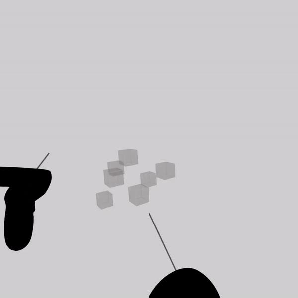

Play here: https://oburdasov.github.io/minesweeper-vr/
---

### Controls:
* Hold trigger a bit to mark mine
* Hold grip button (middle finger) to rotate
* Hold both grip buttons to scale grid
* Move thumbstick to change selector (black line) length
---
* Press A to change theme
* Press B to change difficulty
